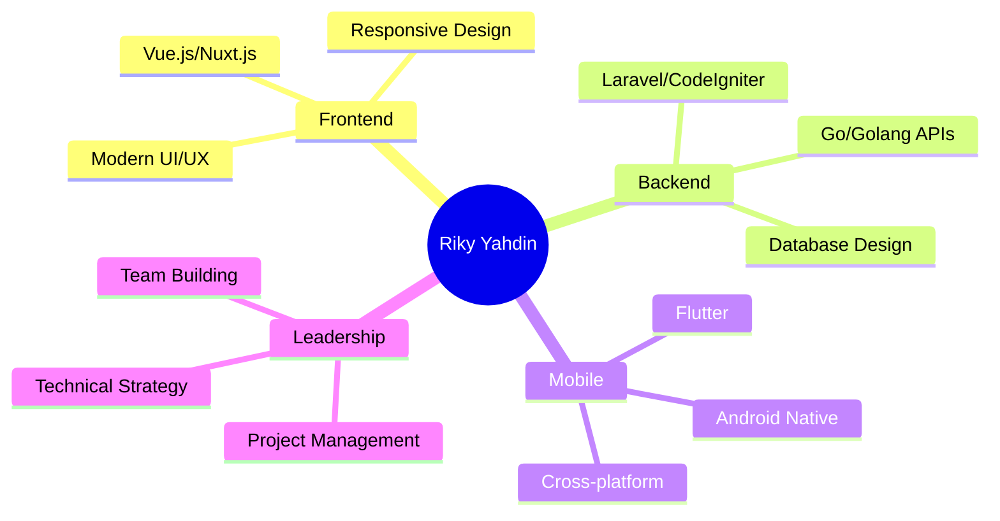

<div align="center">

# 🚀 Hello, I'm Riky Yahdin! 

[](https://git.io/typing-svg)

</div>

---

## 🌟 About Me


🎯 **Passionate Fullstack Developer** dengan **5+ tahun pengalaman** membangun solusi teknologi inovatif

🏢 **Direktur & Lead Developer** di **CV. Tiga Berlian Code** - Leading IT Company di Aceh

💼 **Spesialisasi**: E-Government Solutions, Mobile Apps & Web Development

📍 **Based in**: Banda Aceh, Indonesia

🌱 **Currently Learning**: Advanced Flutter, Cloud Technologies, DevOps

⚡ **Fun Fact**: Saya telah mengembangkan 10+ aplikasi untuk pemerintahan Aceh!

---

## 🛠️ Tech Arsenal

<div align="center">

### 🚀 Languages & Frameworks


### 🗄️ Databases & Tools


</div>

---

## 🏆 Featured Projects Portfolio

<table>
<tr>
<td width="50%">

### 🏛️ Government Solutions
```yaml
🏢 E-Government Platform Development
🎯 Focus: Digital Transformation

✅ Sistem Absensi Dinas Pendidikan
✅ Aplikasi Keanggotaan Partai PKP  
✅ SIPGAM Village Management
✅ Various Government Portals
```

</td>
<td width="50%">

### 📱 Mobile & Web Apps
```yaml
📺 Media & Entertainment Solutions
💼 Business Management Systems

✅ Puja TV Payment & Streaming
✅ Yasir Mandiri Distributor
✅ Guru Berjuang Educational Platform
✅ Transportation Apps (In Progress)
```

</td>
</tr>
</table>

---

## 📊 GitHub Analytics

<div align="center">


</div>

<div align="center">

</div>

---

## 🎯 What I Do Best

<div align="center">



</div>

---

## 🏅 Professional Journey

<details>
<summary>🎓 <b>Education & Certifications</b></summary>

- 🎓 **S.Kom** - Teknik Informatika, Universitas Ubudiyah Indonesia
- 🎓 **D3** - Teknik Informatika, Politeknik Aceh Selatan
- 📜 **Bootcamp Full-Stack**: Laravel Vue Nuxt JS (2023)
- 📜 **Flutter Mobile Developer** (2021)
- 📜 **Mastering Flutter 2.0**: Travel App Development (2022)

</details>

<details>
<summary>🚀 <b>Current Focus & Projects</b></summary>

- 🔨 **SIPGAM**: Village Management System (Active Development)
- 🚌 **Moda Transportasi**: Transportation Management Platform
- 🏛️ **Government Digital Transformation**: Multiple ongoing projects
- 📱 **Mobile-First Solutions**: Flutter & Progressive Web Apps

</details>

---

## 🌐 Connect With Me

<div align="center">

[](mailto:rikyyahdin@gmail.com)
[](https://wa.me/6281265111198)
[](mailto:cvtigaberliancode@gmail.com)

</div>

---

<div align="center">

### 💭 Philosophy

*"Mandiri dalam bekerja. Merdeka adalah berkaya."*

**Building the future of technology in Aceh, one innovative solution at a time** 🌟

---


[](https://github.com/3BCode)

</div>
